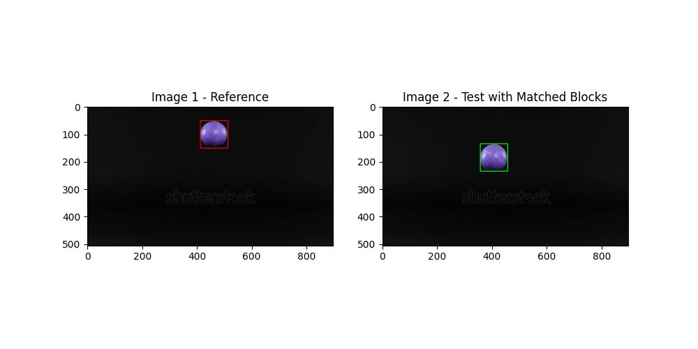
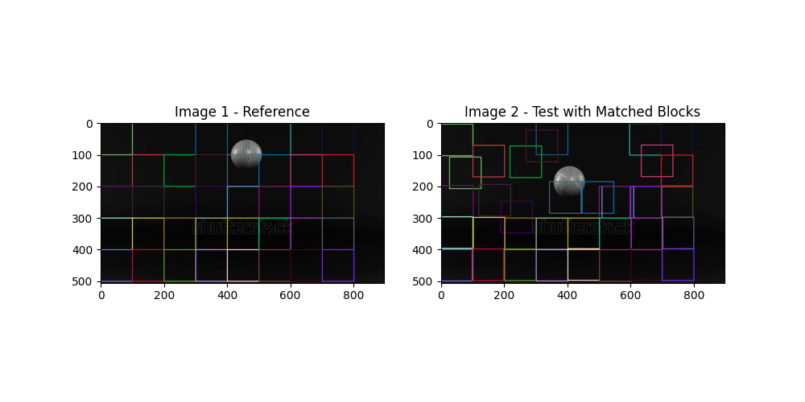
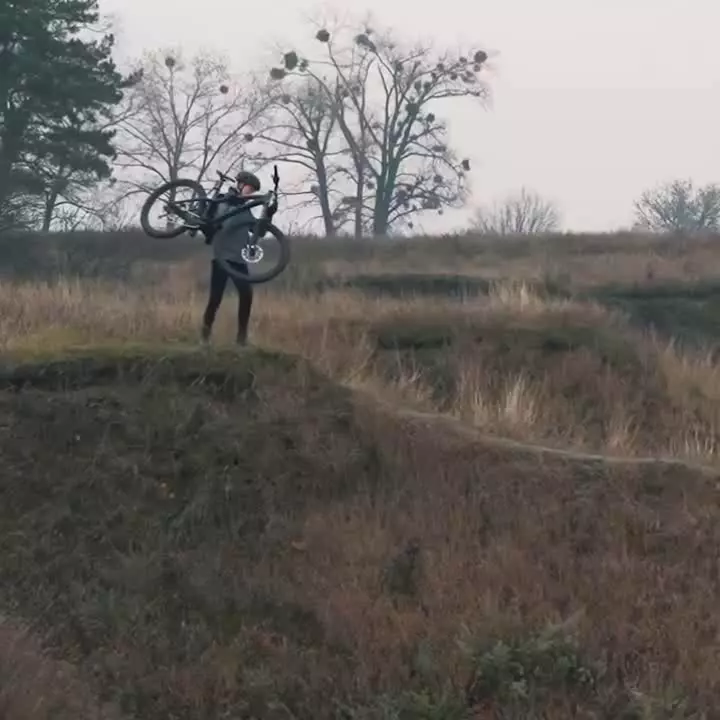
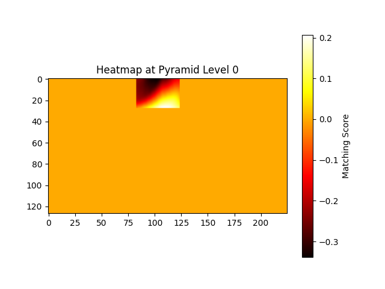
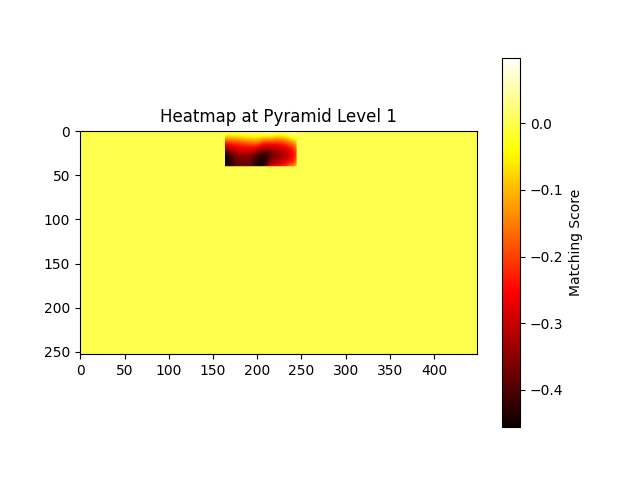
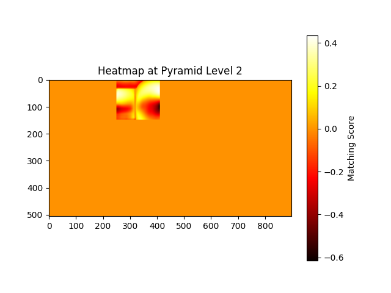

# HMatch

This project implements **a hierarchical block** matching algorithm for analyzing video frames. The algorithm is optimized to reduce execution time for block matching by using **a multi-resolution pyramid** approach. It allows for both manual block matching and full-frame processing, with visualization of results and performance analysis.

## Getting Started

### Prerequisites

Ensure you have the following installed:

- Python 3.8>=
- Required python libs:
    ```bash
    pip install opencv-python matplotlib numpy tqdm networkx
    ```

```bash
.
├── core/
│   ├── argparser.py                # Argument parsing logic
│   ├── globals.py                  # Global variables for the project
│   ├── __init__.py                 # Empty file to make src a Python package
│   ├── block_matching.py           # Core implementation of hierarchical block matching
│   ├── test_block_matching.py      # Unit tests for the block matching implementation
│   ├── utils.py   
├── scripts/
│   ├── run_manual_block.py         # Manual block matching
│   ├── run_frame_blocks.py         # Frame-wide block matching
│   ├── visualize_results.py        # Visualize matched blocks and residuals
├── data/
│   ├── video.mp4                   # Example video file
├── analysis/
│   ├── profiler.py                 # Performance measurement tools
├── main.py                         # Entry point for the program
├── README.md 
├── LICENSE
```

## Usage

Run the program via main.py with the following options:

### Command-Line Arguments
```powershell
python main.py -a [algorithm] -v [video_path] -f [frame_index] -sf [second_frame_index]-b [block_coords] -m [metric] 
```


| Argument       | Short | Type   | Default      | Description                                                                                       |
|----------------|-------|--------|--------------|---------------------------------------------------------------------------------------------------|
| `--algorithm`  | `-a`  | String | `log`     | Algorithm to run (`logarithmic`, `log`, `hierarchical`,`hier`).                                            |
| `--type`  | `-t`  | String | Required     | Script to run (`sequence`, `manual`,`frame`).                                            |
| `--video`      | `-v`  | String | Required     | Path to the video file.                                                                          |
| `--frame`      | `-f`  | Int    | `0`          | Frame index to analyze.                                                                          |
| `--secondframe`| `-sf` | Int    | `None`       | Second frame index to analyze.                                                                  |
| `--block`      | `-b`  | String | `32,32`      | Block coordinates `(y,x)` for manual block matching.                                             |
| `--metric`     | `-m`  | String | None         | Performance metric to analyze (`time`, `memory`).                                                |
| `--levels`     | `-l`  | Int    | `3`          | Number of pyramid levels to construct.                                                          |
| `--graph`      | `-g`  | Flag   | `False`      | Enable graphical output.                                                                         |
| `--size`       | `-s`  | Int    | `16`         | Set block size for all block matching.                                                          |
| `--search`     | `-sa` | Int    | `16`         | Search Area size to analyze |


### Examples

1. **Manual Block Matching:**

   
   ```bash
   python main.py -a hier -t manual -v data/video.mp4 -f 10 -b 32,32
   ```

2. **Frame-Wide Block Matching:**

   
   ```bash
   python main.py -a frame -v data/video.mp4 -f 10
   ```

3. **Visualize Hierarchical Algorithm Flow:**
   ```bash
   python main.py -a hier -t hierarchical -v data/video.mp4 -f 10 -b 32,32
   ```

4. **Performance Analysis (Execution Time):**
   ```bash
   python main.py -a hier -t frame -v data/video.mp4 -f 10 -m time
   ```

5. **Sequence Bloc Matching:**

   
   ```bash
   python main.py -a hier -t sequence -v data/low-2.mp4 -f 10 -sf 50 -b 150,140 -g -sa 32 -s 180 -l 3 
   ```
   **Another example** :
   

6. **Heatmap Debug:**

   You can also debug with a heatmap if needed. You need tho to change the script. you have to go to [block_matching.py](src/block_matching.py), then, change `DEBUG` to `True`
   ```python
   DEBUG = True
   ```
   


## Dechotomic Search
Here are some results with the new algorithme Log (dichotomous)


